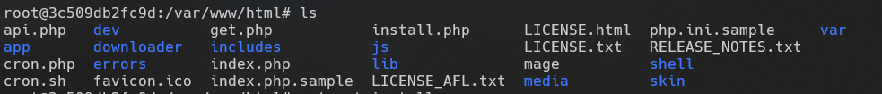

# Docker Magento 1.9 com MySQL

Este projeto configura um ambiente Docker para executar o Magento 1.9 com um banco de dados MySQL. Siga as instruções abaixo para configurar e iniciar o ambiente.

## Pré-requisitos

- Docker Desktop instalado no Windows
- Volume persistente configurado em `C:\DockerOpenSource`

## Passo a Passo

### 1. Preparar o Ambiente

Certifique-se de que o Docker Desktop está instalado e funcionando no seu sistema Windows. Crie a pasta `C:\DockerOpenSource` se ela ainda não existir.

### 2. Criando o diretório para colocar os arquivos

Crie uma pasta com o nome que desejar. Eu criei com o seguinte nome: `magento-docker`

### 3. Criar o arquivo `docker-compose.yml` dentro de `magento-docker`

Crie um arquivo chamado `docker-compose.yml` com o seguinte conteúdo:

```yaml
version: '3.7'

services:
  magento:
    image: alexcheng/magento:1.9.3.8
    container_name: magento
    ports:
      - "80:80"
    environment:
      MYSQL_ROOT_PASSWORD: rootpass
      MYSQL_DATABASE: magento
      MYSQL_USER: magento
      MYSQL_PASSWORD: magento
    volumes:
      - magento_data:/var/www/html
    depends_on:
      - db
    restart: always

  db:
    image: mysql:5.7
    container_name: magento_db
    environment:
      MYSQL_ROOT_PASSWORD: rootpass
      MYSQL_DATABASE: magento
      MYSQL_USER: magento
      MYSQL_PASSWORD: magento
    ports:
      - "3306:3306"
    volumes:
      - db_data:/var/lib/mysql
    restart: always

volumes:
  magento_data:
  db_data:

networks:
  default:
    name: magento_network
```

### 4. Executando o comando para iniciar os containers

```
docker-compose up -d
```

Execute o comando acima no diretório onde está o `docker-compose.yml` e pronto, as imagens serão carregadas e os containers
iniciados

### 5. Logar no Localhost e verificar se o Nginx está instalado com sucesso

Após inicializar os containers, digite `http://localhost` no nagegador.

Caso o Nginx esteja instalado com sucesso, deverá aparecer algo como a imagem abaixo:


### 6. Verificar se os arquivos Magento estão dentro de `/var/www/html`

Execute os comandos abaixo no seu powershell

```
- docker exec -it magento /bin/bash
- cd /var/www/html
- ls
```

Precisa aparecer algo como:




### 7. Instalando o nano

```
apt-get install nano
```

### 8. Abrindo o arquivo do apache2 e verificar os sites disponíveis

```
nano /etc/apache2/sites-available/000-default.conf
```

Precisa aparecer algo como:


##### Pronto, agora basta digitar webmaster@localhost e irá aparecer a tela de configuração do Magento
